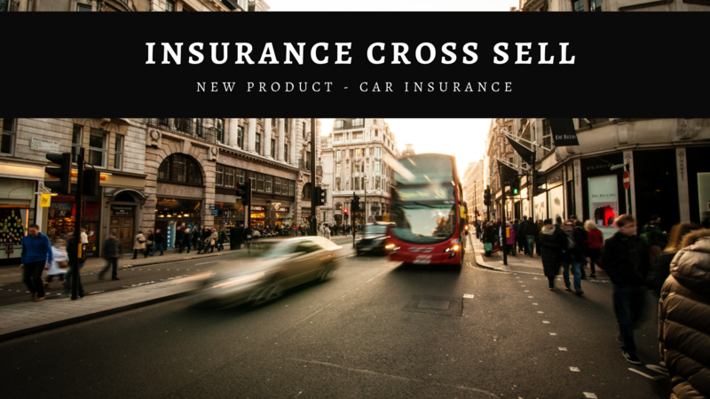

#### This project was made by Eron Oliveira.

# 1. Business Problem.
The company provides health insurance to its clients and the product team is looking into the possibility of offering clients a new product: car insurance.

Like health insurance, clients of this new auto insurance plan need to pay an amount each year to the insurer to obtain a company-insured sum towards the costs of an accident or damage to their vehicle.

Last year, the insurer surveyed around 380,000 customers about their interest in joining a new car insurance product. All customers expressed interest or not in buying car insurance and these responses were saved in a database along with other customer's attributes.

The product team selected 127,000 new customers who did not respond to the survey to participate in a campaign, in which they will receive the offer of the new car insurance product. 

The offer will be made by the sales team through phone calls. However, the sales team can make only 20,000 calls within the campaign period.

In this context, it is necessary to build a solution that indicates whether the customer will be interested in car insurance or not.

Based on the solution, the sales team wants to prioritize the people most interested in the new product and thus optimize the campaign by only making contacts with the customers most likely to make the purchase.

### Business Issues:
1. Key findings on the most relevant attributes of customers interested in purchasing car insurance.
2. What percentage of customers interested in purchasing car insurance will the sales team be able to contact by making 20,000 phone calls?
3. And if the sales team's capacity increases to 40,000 phone calls, what percentage of customers interested in purchasing auto insurance will the sales team be able to contact?
4. How many phone calls do the sales team need made to contact 80% of the customers interested in purchasing car insurance?

# 2. The solution

The solution was to develop an intelligent model that ranked car insurance prospects by personal characteristics. The tool processed the first database provided and was available in a spreadsheet for the sales team to access and perform new classifications whenever necessary.

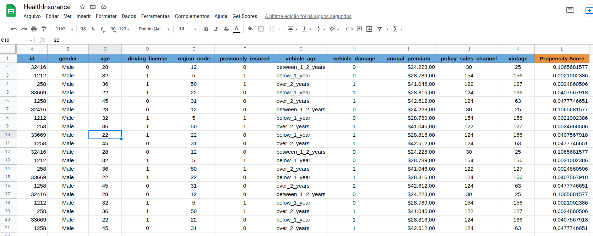

## 2.1 Solution Strategy

My strategy to solve this challenge was:

### Step 1. Data Description:

The initial DataSet has _381109 rows_ and _12 columns_. The features are the following:

- **id**: Customer identifier
- **gender**: Gender of customer
- **age**: Age of customer
- **region code**: Region code of customer
- **policy sales channel**: anonymous code for contact with customer.
- **previously insured**: 0 if customer does not have a vehicle insurance; 1 if customer already has a vehicle insurance.
- **annual premium**: amount paid for health insurance to the company anualy.
- **vintage**: time (in days) that customer bought his health assurance.
- **driving license**: 0 if customer does not have the permission for drive; 1 if customer has the permission for driveRegion
- **vehicle age**: Age of vehicle
- **vehicle damage**: 0 if customer never got involved in a previous vehicle damage; 1 if customer already had a vehicle damage
- **response**: 0 if customer has no interest in product; 1 if customer has interest in product

Of the 12 variables, only 3 are numeric and are summarized like this:

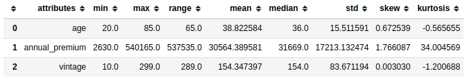

The variable **annual_premium** has a range of approximately 537000, however its average is close to 30500. There may be outliers in this feature.

### Step 2. Feature Engineering:

In this phase, new features were created and modified to allow a more complete analysis.

The features **vehicle age**, **vehicle damage**, and **gender** had their formats changed and became **numeric**. Also, the feature **damage per rcode** was created, which analyzes the amount of vehicles damaged per residence code.

### Step 3. Exploratory Data Analysis:

Univariate, bivariate, and multivariate data analyses were performed. The study provided statistical properties of each of the characteristics, correlations, and test hypotheses.

### Step 4. Data Preparation:

At this point, actions of **standardization, rescaling, and transformation (encoding)** of the variables were carried out, seeking uniformity of data.

### Step 5. Feature Selection:

The selection of the features used three steps:

1. The results obtained in the EDA;
2. The application of the Boruta package;
3. The application of Features Importance.

The results were as follows:

**From EDA:** 'vehicle damage', 'policy sales channel', 'vehicle age', and 'previously insured'.

**From Boruta:** 'age'

**From Features Importance:** 'vintage', 'annual premium', 'age', 'vehicle damage', 'policy sales channel', 'previously insured', 'region code', and 'damage per rcode'.

**The features final list is:**
- 'vehicle damage'
- 'policy sales channel'
- 'vehicle age'
- 'previously insured'
- 'vintage'
- 'annual premium'
- 'age'
- 'region code'
- 'damage per rcode'

### Step 6. Machine Learning Modelling:

The machine learning models were trained and submitted to cross-validation. The model with the best result went through a hyperparameter tuning phase to optimize the generalization. 

Details are available in the follow-up of this report.

### Step 7. Convert Model Performance to Business Values:

Translating the results of Machine Learning models into business objectives is the most important goal of a Data Science project. In this case, the correct classification of customers will mean a higher sales volume using the same budget defined by the company.

### Step 8. Deploy Modelo to Production:

The model is deployed in a cloud environment to make it possible for other stakeholders and services to access its results.

The deployment enabled the processing of the first load of data provided by the company. 

In addition, an online spreadsheet was developed that will allow the company's team to make classifications and conduct studies on customer profiles.

# 3. Data Insights

The hypotheses were developed by creating a mind map, where the variables that influence the business model were listed.

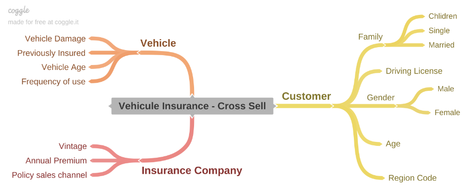

The map and analysis of the features assisted in the development of the list of insights below, which were statistically validated.

## 3.1 Hypotheses Final List

1. Women are more likely to take out car insurance.
2. The older the age, the greater the possibility of taking out car insurance.
3. The place of residence influences the decision to take out car insurance.
4. People who have had damage to their cars are more likely to take out car insurance.
5. People who already have car insurance are more likely to purchase a new policy.
6. People with newer vehicles are more likely to take out car insurance.
7. Clients with an older relationship with the insurance company are more likely to contract a new product.
8. Customers with higher health insurance expenses are more likely to purchase a new product.

## 3.2 Top 3 Data Insights

**Hypothesis 1: Women are more likely to take out car insurance.**

The hypothesis is **FALSE**, the interest among men is percentage higher.

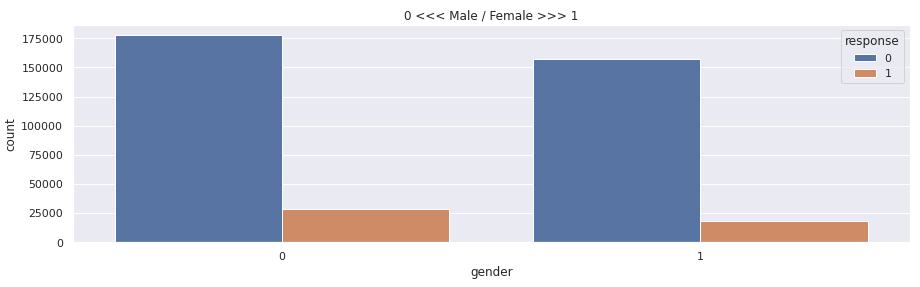

The percentage of interest among FEMALES and MALES who responded to the survey is 10.39% and 13.84% respectively. Although there is a difference of approximately 30% in the level of interest, there are no reasons to despise either group.

**Hypothesis 2: The older the age, the greater the possibility of taking out car insurance.**

The hypothesis is **FALSE**. There is a limit of age to an interest in a new policy.

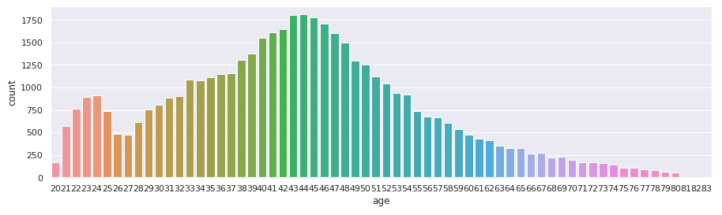

The customers with the highest level of interest in new car insurance are distributed in a range that varies between the ages of 35 and 50 approximately.

**Hypothesis 3: People who have had damage to their cars are more likely to take out car insurance.**

The hypothesis is **TRUE**. When happened car damage, there is car insurance interest.

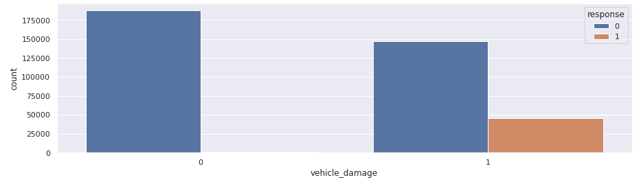

Customers who have had their cars damaged previously understand better the importance of having car insurance.

# 4. Machine Learning Model Applied

The following machine learning models were trained:

- **K Neighbors Classifier - KNN**
- **Logistic Regression**
- **Random Forest Classifier**
- **Naive Bayes Classifier**
- **XGBoost Classifier**

All the models applied went through the **Cross Validation** stage.

# 5. Machine Learning Model Performance

The choice of the final model to build the solution depends on the generalization capacity it will present. The indicator chosen was **"Recall at K"** because it tells us the proportion of relevant items found within the total number of defined items.

The following table shows the performance of the models after the **"Cross-Validation"** phase. Although the performance of all of them was very close, the **"XGBoost Classifier"** model presented the best result in the "Recall at K" indicator.

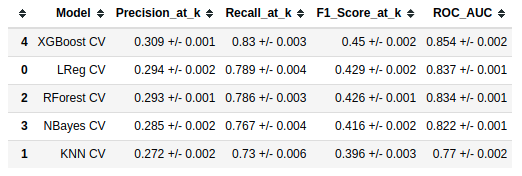

The performance curves show that the model can classify **all those interested** in purchasing the product using approximately **50% of the sample** (**Cumulative Gains Curve**). Furthermore, we can also see that the model is initially **four times better** than using a random technique to choose customers. After reaching **half of the data**, it remains **twice** as good as the alternative way of classification.

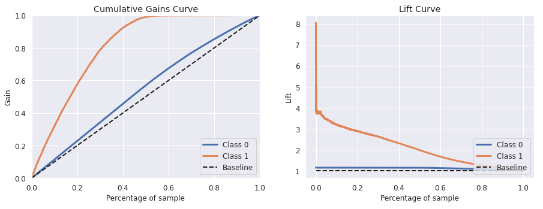

# 6. Business Results

### Business Issues:
1. Key findings on the most relevant attributes of customers interested in purchasing car insurance.

The most relevant attributes of customers interested in purchasing motor insurance are as follows:
- **Age:** the interest in contracting car insurance is concentrated in the age range of 35 to 50 years old approximately.
- **Vehicle Damage:** almost all clients who participated in the survey and answered that they are interested in taking out auto insurance have already had damage to their vehicles.
- **Previously Insured:** almost all of the clients who expressed interest do NOT currently have insurance.
- **Vehicle Age:** the interest in contracting car insurance is concentrated on clients who own cars between 2 and 3 years old.

2. What percentage of customers interested in purchasing car insurance will the sales team be able to contact by making 20.000 phone calls?

The percentage of **interested customers** among the first **20000** ranked is **47.5%**.

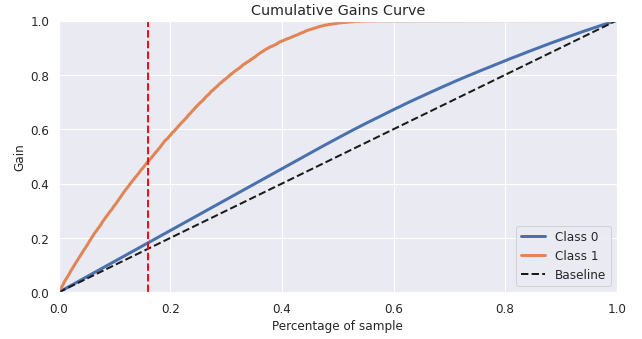

3. And if the sales team's capacity increases to 40.000 phone calls, what percentage of customers interested in purchasing auto insurance will the sales team be able to contact?

The percentage of **interested customers** among the first **40000** ranked is **81.2%**.

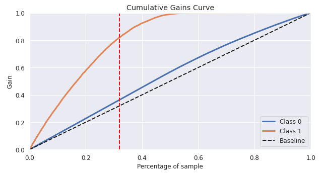

4. How many phone calls do the sales team need made to contact 80% of the customers interested in purchasing car insurance?

To contact **80% of the customers interested** in purchasing car insurance, the sales team wiil be made **23442 calls**.

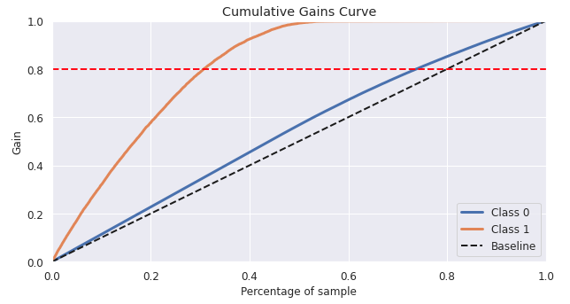

# 7. Conclusions

The project has demonstrated as its principal conclusion that using a Machine Learning model to perform the classification of possible customers is more effective than random sorting.

The sales team will need to make calls to 59.8% of customers to reach 100% of interested parties. In a regular model, this rate would only be achieved by calling all customers. In other words, using data science techniques can save approximately 40% in customer contact costs. 

# 8. Next Steps to Improve

- Search for **new features** to improve the final result;
- **Balancing** the response variable to test the results;
- Improve the **fine-tuning** parameters;
- Search for information about the **costs of the contacts made by the sales team** to improve the business result. 

### LICENSE

#### - MIT License -

#### All Rights Reserved - Comunidade DS 2021
